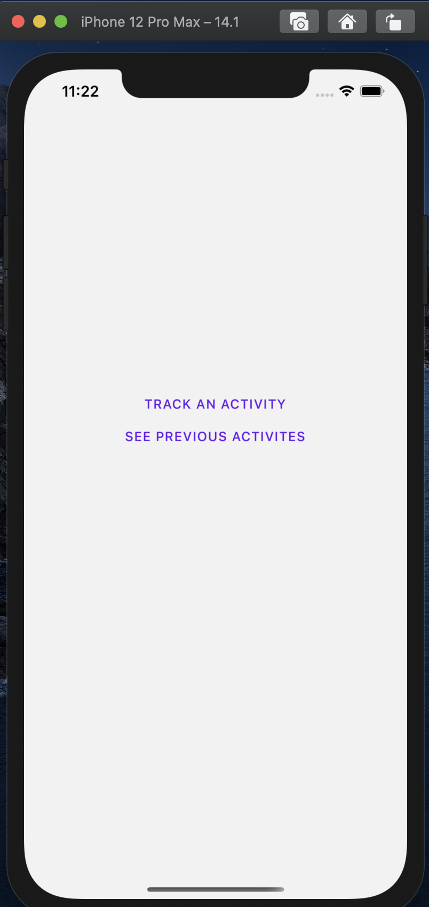
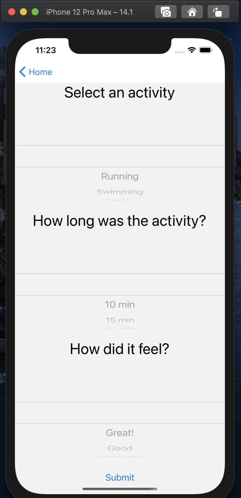
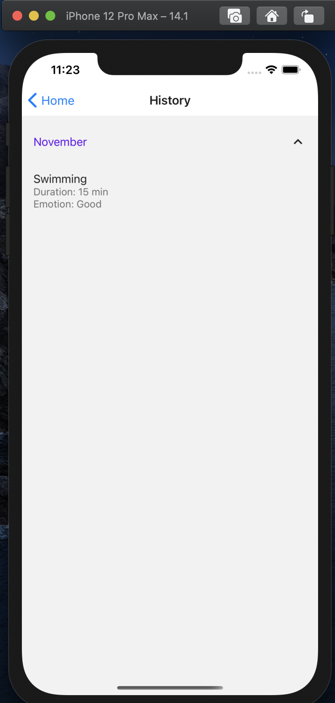
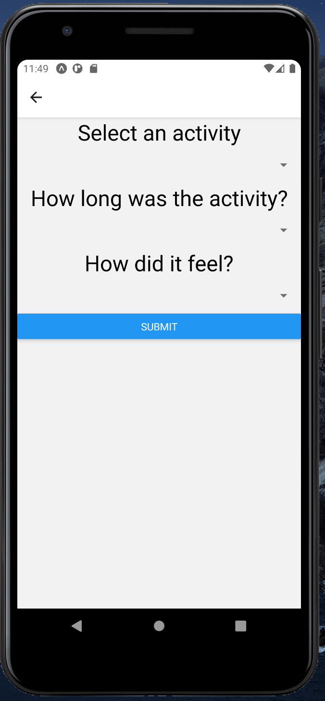
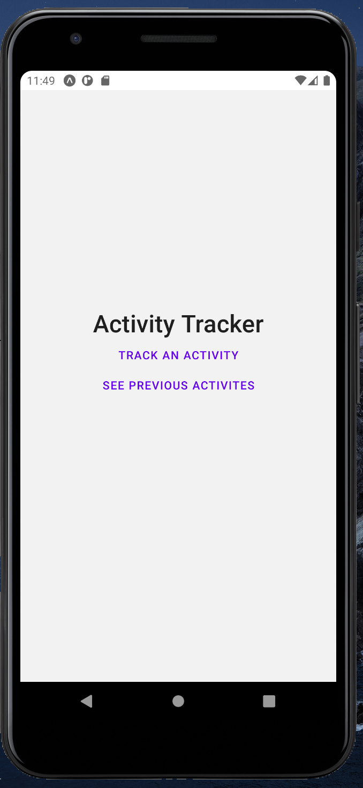
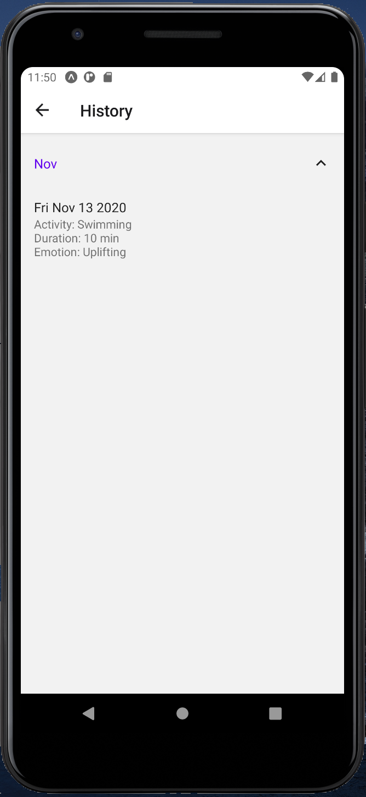

<!-- TABLE OF CONTENTS -->
## Table of Contents

* [About the Project](#about-the-project)
  * [Built With](#built-with)
* [Prerequisites](#prerequisites)
  * [Getting Started](#getting-started)
  * [Installation](#installation)
* [Usage](#usage)
* [Contact](#contact)

## About The Project
## IOS



## Android




This is a front end mobile application built in React Native with expo that keeps track of your physical activities. I made this project to learn React Native and build out a project in it. I used TypeScript in the project because I enjoy type safe features with autocomplete and realize the value in seeing your mistake before making it so things are well thought out beforehand. 

### Built With

* [ReactNative](https://reactnative.dev/)
* [JavaScript](https://www.javascript.com/)
* [TypeScript](https://www.typescriptlang.org/)

### Prerequisites

* npm
```sh
npm install npm@latest -g
```
* TypeScript
```sh
npm install -g typescript
```

* XCode 
[XCode](https://apps.apple.com/us/app/xcode/id497799835?mt=12)

* Android Studio
[Android Studio](https://developer.android.com/studio)


## Getting Started / Installation

1. On the top right, clik on 'Fork'
2. Click on 'Clone' and copy the command
3. Open up terminal and paste and run
4. type `cd mobile-activity-tracker` in the terminal
5. type `npm install` in the terminal
6. Go to expo and follow their download instructions [Expo](https://expo.io/)
7. Download Xcode to run in an iphone simulator
8. run `npm start` in the terminal
9. Once the expo browser opens up, click on 'Run on IOS Simulator' or open up Android Studio and run any android device and click 'Run on Android device/emulator'
10. Have fun!


## Usage

The user enters the application, at that point I use AsyncStorage to check if they've been there before or set the user. From that main page, the user can then choose if they want to track an activity which includes type, duration, and emotion. After they click sumbit, the app lets the user know they have saved the task and at that point they can go to their history page. In the history page, there's an accordion list which is categorized by month which shows all the activities they did for the month.

## Contact

 [Rostam Mahabadi](https://www.linkedin.com/in/rostam-mahabadi/) 


